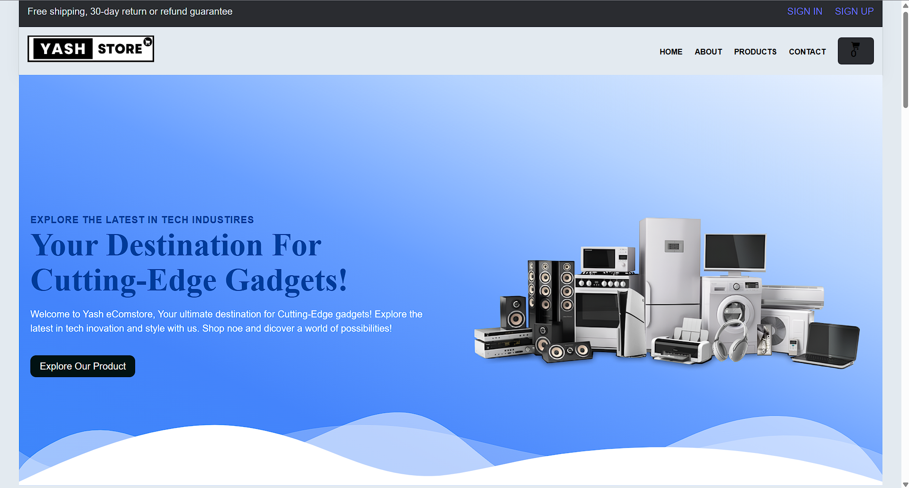
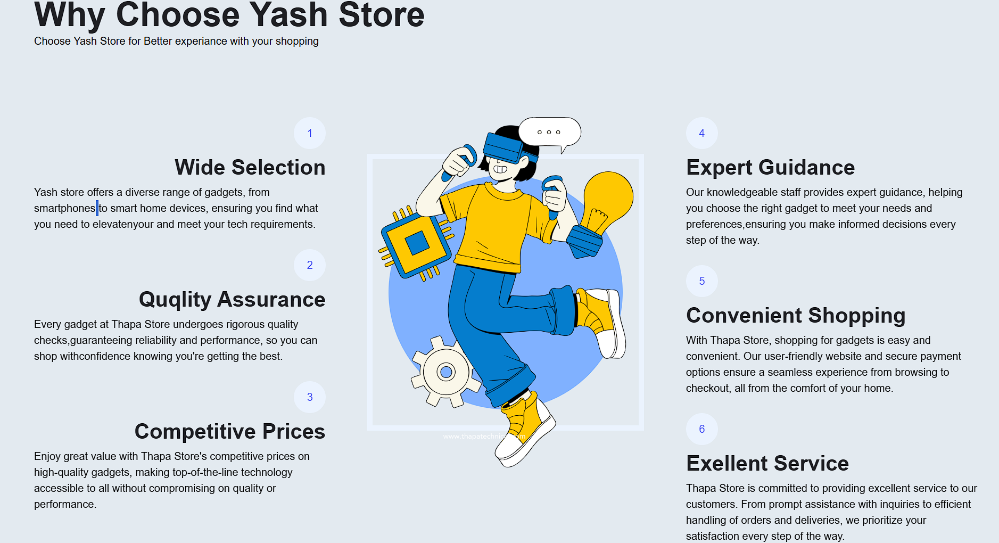
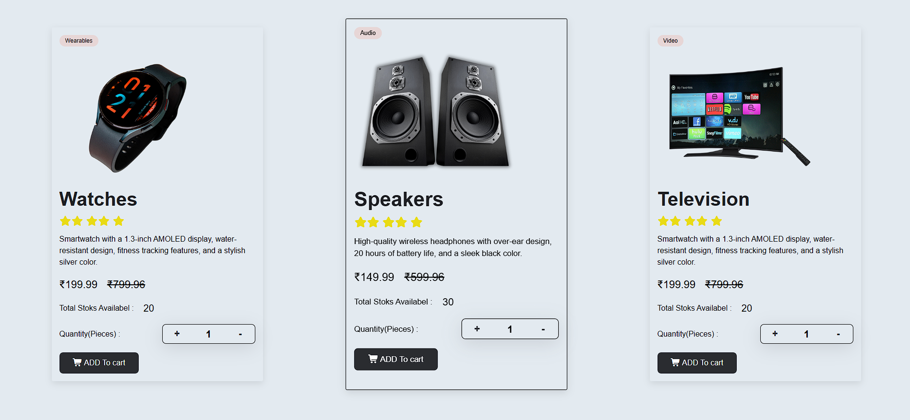
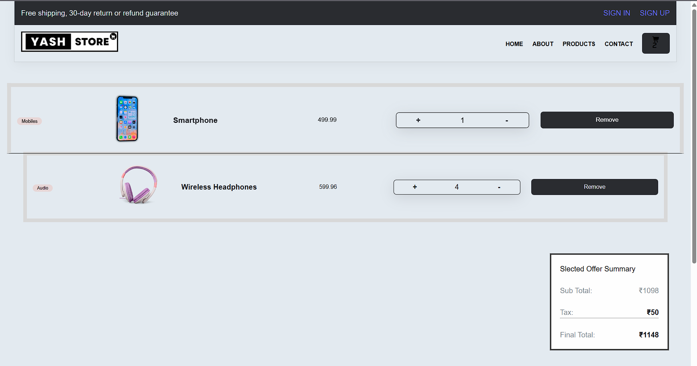

# 🛒 Yash Store - JavaScript E-Commerce Website

A fully responsive **E-Commerce Website** built using **HTML, CSS, and JavaScript**. This project was developed during my **2nd Year (1st Semester)** to practice JavaScript concepts such as DOM manipulation, JSON data handling, Local Storage, and dynamic shopping cart functionality.

The website allows users to browse products, manage cart items, update quantities, and view the total bill in real time.

---

## 📸 Screenshots

### Home Page


### Why Choose Us


### Products Section


### Shopping Cart


---

## ✨ Features

- Responsive E-Commerce Website
- Modern Landing Page
- Product data loaded dynamically from a JSON file
- Dynamic Product Cards
- Product Categories
- Add products to Cart
- Increase and Decrease Product Quantity
- Remove Products from Cart
- Automatic Cart Total Calculation
- Tax Calculation
- Order Summary
- Shopping Cart Counter
- Local Storage support (Cart data remains after page refresh)
- Clean and User-Friendly Interface

---

## 🛠️ Technologies Used

- HTML5
- CSS3
- JavaScript (ES6)
- JSON
- Local Storage API

---

## 📂 Project Structure

```
Yash_Store/
│
├── images/
├── css/
├── js/
├── api/
│   └── products.json
├── index.html
├── about.html
├── products.html
├── contact.html
└── README.md
```

---

## ⚙️ How It Works

- Product information is stored inside a **JSON file**.
- JavaScript fetches the product data and creates product cards dynamically.
- Users can:
  - Browse available products
  - Add products to the shopping cart
  - Increase or decrease product quantity
  - Remove products from the cart
- The cart automatically calculates:
  - Subtotal
  - Tax
  - Final Total
- Cart data is stored using **Local Storage**, so it remains available even after refreshing the page.

---

## 🚀 Getting Started

### Clone the Repository

```bash
git clone https://github.com/YashSatpute3142/YOUR_REPOSITORY_NAME.git
```

### Open the Project

Open `index.html` in your browser.

No additional installation or dependencies are required.

---

## 📚 What I Learned

While building this project, I gained practical experience with:

- DOM Manipulation
- Event Handling
- Fetch API
- Working with JSON Data
- Local Storage
- Dynamic Rendering
- JavaScript Objects & Arrays
- Shopping Cart Logic
- Responsive Web Design

---

## 🔮 Future Improvements

- User Authentication
- Product Search
- Product Filtering
- Wishlist Feature
- Checkout Page
- Payment Gateway Integration
- Backend Database
- Order History
- User Dashboard

---

## 👨‍💻 Author

**Yash Satpute**

- GitHub: https://github.com/YashSatpute3142

---

## ⭐ If you like this project

If you found this project helpful or interesting, consider giving it a ⭐ on GitHub!
